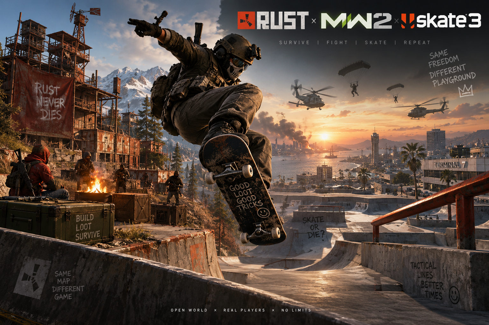

# PC survival / FPS / Skate



We bouwen een zelfstandige **multiplayer-pc-survivalgame in Rust en Bevy**, met survival
en bases geïnspireerd door Rust, gunplay en operators geïnspireerd door MW2,
en skateboarden geïnspireerd door Skate 3. De wereld en gamecontent maken we
zelf: modellen, materialen, animaties en geluiden.

Alle tekst in het spel is Engels en blijft Engels: HUD, inventory, editor,
bedieningshints en meldingen. Dit geldt ook voor nieuwe bijdragen.

Het eindproduct moet zonder originele gamebestanden starten. Het gebruikt
publieke engine-/rewritecode en eigen content. De volledige featurelijst en
het onderscheid tussen aanwezige code, controles en speelbaarheid staan in
[TODO.md](TODO.md).

**Status: onafgewerkte ontwikkelbroncode. Er is nog geen afgewerkt speelbaar
product of releasebinary.** De repository dient als broncodeoverdracht en
voortgangsoverzicht. Wij verifiëren de implementatie zelf voordat we een
speelbare release leveren.

## Eerstvolgende productmijlpaal: multiplayer

De eerste productmijlpaal is samen spelen in één gedeelde wereld. De huidige
standalone `game`-modus is een lokale ontwikkelsandbox; de bestaande controles
daarvan bewijzen nog geen multiplayer-survival. We werken eerst aan één
autoritatieve server en twee verbonden clients, gevolgd door gedeeld bouwen,
verzamelen, inventory, gevechten en skaten. Het ontwerp en de acceptatiecriteria
staan in [docs/MULTIPLAYER.md](docs/MULTIPLAYER.md) en
[issue #243](https://github.com/Dj-Shortcut/mw2-rust-rust-rewrite/issues/243).
De gedeelde kern en een directe TCP-server/clientadapter zijn nu aanwezig.
Eén echt serverproces en twee afzonderlijke clients doorlopen bewegen, eindig
verzamelen en een gedeelde Wood foundation in 79 headless controles.
De native `join IP:PORT`-route is aanwezig voor een ongewapend gather/build-prototype,
met Hemp→Cloth→Bandage en een eigen bevestigde inventory. Bandages kosten 4 Cloth;
hout blijft bouwmateriaal. De verbonden flow en oude offline saves worden
afzonderlijk gecontroleerd. Zie [Cloth en crafting](docs/CONNECTED-CRAFTING.md).
Vrijwillige spelershandel is aanwezig: één Bandage voor 25 Wood, met expliciete
acceptatie en een atomische serveroverdracht. De echte TCP-flow slaagt voor 55
controles; twee native clients voor 115 en gewone executables voor 38 beperkte
venstercontroles. Alle vijf gelabelde volledige-inventoryweergaven passen op 720p.
Zie [handel en verificatiegrenzen](docs/CONNECTED-TRADING.md).
Verbonden Wood-muren zijn aanwezig in de broncode: Foundation kost 200 Wood,
Wall 100 Wood, met stukselectie en twee richtingen. De echte TCP-routes voor beide
richtingen slagen voor 70 en 71 controles; authority 62, codec 392, software-invoer
585, mailbox 664 en pure panelweergave 28 zijn afzonderlijk gecontroleerd.
Twee native keyboard/Mesa-routes slagen voor 110 en 113 controles; lokale
Cargo-gates slagen. Gewone-build OCR en 720p-layout hebben nog open controles;
exacte runtime-CI/review en integratie blijven pending. Zie [bediening en gecontroleerde grenzen](docs/CONNECTED-BUILDING.md).
De geoptimaliseerde Linux-build en afzonderlijke controles van previews (61),
software-invoer (70) en de echte netwerkworker (46) slagen. Twee gewone
executables doorlopen 24 beperkte toetsenbord/Mesa-venstercontroles. Daarnaast
slagen 101 controles met twee echte Bevy-clients en een alleen-lezen observer:
eindig verzamelen→fundering, gedeelde scene/colliders, pauze, fouten en opruiming.
Bouwvlakken en Engelse UI zijn ook visueel nagekeken. Volledige survival en
internet-/persistentieflows blijven onafgewerkt. Zie
[docs/NATIVE-MULTIPLAYER.md](docs/NATIVE-MULTIPLAYER.md) voor de verbonden bediening en
[docs/DIRECT-MULTIPLAYER.md](docs/DIRECT-MULTIPLAYER.md) voor de transportgrenzen.
De eerdere tijdschatting voor een offline testversie dekt deze mijlpaal niet.

## Bijdragen

Vrijwilligers zijn welkom. Begin met de documentatie en een afgebakend issue,
werk op een eigen branch en lever een gerichte PR met controles en bijgewerkte
docs. De Engelstalige [CONTRIBUTING.md](CONTRIBUTING.md) beschrijft de werkwijze.

## Huidige implementatie

- Rust/Bevy-enginebasis met IW4L en de publieke MW2/Skate-integratie uit
  [2010-rust-rewrite-mashup](https://github.com/chasmlol/2010-rust-rewrite-mashup).
- Bouwkern: funderingen, vloeren, muren, deuren, eigendom, materialen,
  kosten/upgrades, ondersteuning/instorting en gevalideerde opslag.
- Autoritatieve kogel-/mêleeschade, loopcollisie en bouwstaat in wereldsnapshots.
- Lokale hostbouwbediening voor toetsenbord/muis en Xbox-controller op pc.
- Eigen procedurele hout-, steen- en metaalmaterialen zonder texturedownloads.
- Optionele SDK-v9-mapinspectietool; die is geen speelbare wereldimport.
- Zelfstandige sessie met eigen ingebedde gamescripts, een klein eigen eiland,
  first-person bewegen, schieten, schade, dood en respawn.
- Inventory met 24 slots, eindige startvoorraad, bandage-/munitierecepten,
  voedsel/water en honger/dorst; 32 eindige oogstnodes, inclusief twee Hemp-planten
  voor Cloth.
- Eigen ramps, quarterpipes, rails, trappen, platforms en funboxes, met plaatsing,
  rotatie, verwijderen, undo/redo en gevalideerde sessie-opslag. Groen/rode previews
  tonen plaatsingsregels; bouwpreviews tonen de werkelijke materiaalkosten.
- Skatecontroller met pushen, sturen, remmen, ollies, spins/flips, landingspunten,
  bails en collisie met hetzelfde terrein en geplaatste ramps.
- Vier eigen 3D-modellen en zeven procedureel gemaakte CC0-geluiden, met
  reproduceerbare generators onder `scripts/`.

De eerdere sessiebootstrap is opgelost met onze eigen regels, zonder originele
gamescripts. Headless controles doorlopen nu bewegen, munitieverbruik, een NPC
uitschakelen, editorcollisie/undo/opslag, crafting, healing, harvesting,
dood/respawn en de overgang tussen skaten en lopen. De native frontend bevat
de bijbehorende bediening en feedback, inclusief inventory, gathering,
skatecamera, controllerbindings en geluidscues. De uitgebreide compilercontrole
en geoptimaliseerde executablebuild slagen. In een echt Bevy-venster op een
virtueel Linux-scherm zijn de eigen modellen, inventory/crafting, munitieverbruik,
schade, herladen, ADS en de skatecamera met ollie/landingspunten uitgevoerd.
Ook rampplaatsing/verwijderen/undo/redo, scene save/load, foundationkosten en
eindige tree-harvesting zijn via de native bediening uitgevoerd. Inventory-,
pauze- en focusovergangen behouden het camerabeeld. Native dood/respawn en
opnieuw bewegen/schieten zijn met een tijdelijke schadefixture geverifieerd;
die fixture is uit de productcode verwijderd.
Een volledige wereld, de overige survivalsystemen en multiplayerloops moeten
nog worden afgemaakt.
[TODO.md](TODO.md) scheidt implementatie, headless bewijs, grafische verificatie
en releasegereedheid.

## Bouwen en starten

Installeer Rust stable en de [systeemdependencies](docs/BUILD.md). Voor
compilercontrole vanuit de repository:

```bash
cargo check -p launcher -p rust_maps
```

Start de ontwikkelversie vanuit de repository:

```bash
cargo run -p launcher --profile play --locked -- game
```

Voor de headless ontwikkelserver (TCP; standaard alleen localhost):

```bash
cargo run -p launcher --profile play --locked -- server --bind 127.0.0.1:28980
```

Deze server gebruikt procedurele content en vereist geen originele gamefiles.
Verbind twee native ontwikkelclients vanuit afzonderlijke terminals:

```bash
cargo run -p launcher --profile play --locked -- join 127.0.0.1:28980
```

Join gebruikt de eigen modellen: F verzamelt Tree/Hemp, I opent je inventory
en C maakt daar één Bandage voor 4 Cloth. In dat panel biedt V / Controller Right
één Bandage aan voor 25 Wood. De koper accepteert met Enter / Controller A;
Backspace / Controller B annuleert of weigert het huidige aanbod.
B / Controller Back opent bouwmodus: Left / Controller Left kiest Foundation
(200 Wood), Right / Controller Right kiest Wall (100 Wood). Q / Controller LB
wisselt een geselecteerde Wall tussen X-axis en Y-axis; bij Foundation verandert
het niets. Left click / Controller RT vraagt plaatsing aan de server.
Selectie/rotatie/modewissels plaatsen niets in dezelfde frame. `game` blijft offline.
Esc pauzeert lokale bediening; een geplaatst aanbod blijft tot annulatie/verval
actief en verloopt na 30 seconden servertijd. F1 toont de verbonden bediening.
De beperkte verzamelen→craften→ruilen-route is op Linux/Mesa gecontroleerd.
Stop de server met Ctrl+C.

De launcher kiest standaard hetzelfde zelfstandige native startpad. De eigen
content staat onder `assets/authored/` en wordt vanuit de repository gevonden.
F1 toont de bediening; Tab opent inventory, B bouwen, E de objecteditor en V skaten.
Richt in bouwmodus op een eigen bouwstuk: T repareert, Z upgrade naar Stone en
X naar Metal. Xbox Y repareert; D-pad Omhoog/Omlaag upgrade naar Stone/Metal,
Links/Rechts kiest een bouwstuk en LB/RB draait de plaatsingsas. B sluit de
bouwmodus. De bestaande Session-regels bepalen bereik, eigendom, gezondheid,
kosten en fouten. De melding "Place cost" hoort bij het plaatsingsvoorbeeld;
er is geen afzonderlijke reparatie-/upgradetargetpreview of kostenpreview
en geen sloopbediening.
Na een geslaagde F9-load is de bouwmodus uit; druk opnieuw B voor bouwacties.
In de E-objecteditor verplaatst M het object onder het vizier naar het eerste
achterliggende oppervlak op dezelfde kijklijn; dat oppervlak moet omhoog wijzen.
Komma/punt draaien het bestaande object per 15 graden. Xbox Y verplaatst;
houd LT vast en druk LB/RB om het object te draaien. Q/R en LB/RB zonder LT
draaien het plaatsingsvoorbeeld. Ctrl-Z/Y maakt objectwijzigingen ongedaan/opnieuw.
Save met F5 na de bewerking; F9 laadt de pose, sluit de editor en wist de
undo/redo-geschiedenis. Zie [de parkeditorgids](docs/PARK-EDITOR.md) voor regels
en geverifieerde grenzen.
In de inventory kiezen 1–9 of PgUp/PgDn een recept; C craft en R onderzoekt de
geselecteerde blauwdruk. V voegt het recept toe aan de craftingwachtrij; F annuleert
de eerste opdracht met volledige materiaalrefund als die in opslag past.
De inventory pauzeert de wereld: sluit hem om de wachtrij verder te laten lopen.
C / Xbox X blijft direct craften; Xbox-wachtrijbediening is nog niet gekoppeld.
Zie [de craftinggids](docs/CRAFTING.md) voor regels en verificatiegrenzen.
O trekt de geselecteerde kleding aan, P trekt de
gedragen kleding uit en T repareert het geselecteerde gereedschap. N begint
recycling van de gekozen hoeveelheid; Enter bevestigt en Backspace annuleert. Xbox Back onderzoekt een
blauwdruk; Xbox Y/B bevestigen/annuleren een recyclingactie. Kledingbeheer en
reparatie/recycling starten voorlopig met het toetsenbord.
I gebruikt het geselecteerde item in de inventory (Xbox A doet hetzelfde).
In loopmodus drinkt P / Xbox RS click rechtstreeks uit bereikbaar water voor
+10 dorst, zonder itemverbruik of voorraadverlies. O / Xbox D-pad Omhoog neemt
al het opgeslagen water uit de regenton bij de spawn, mits alles in je inventory
past. De eigen ton toont opgeslagen water met blauwe markeringen; droogte en
vorst pauzeren het vullen, terwijl reeds opgeslagen water bereikbaar blijft.
F / Xbox Y verzamelt maximaal 10 Water per oogst uit eindige voorraad; K of
inventory I / Xbox A gebruikt één Water voor +35 dorst. De bestaande inventory
O/P-kledingbediening blijft behouden. Zie [de watergids](docs/WATER.md) voor
bereik, fouten, tijdsverloop en verificatiegrenzen.
In loopmodus plant of oogst T het dichtstbijzijnde bessenbed binnen 100 wereldunits
(3D), zonder te richten. Xbox: houd LB vast en druk RB; vasthouden herhaalt niet.
Planten kost één bessenzaad en één Water; rijpe bessen leveren vijf Food en twee
zaden samen. F / Xbox Y verzamelt bessen/zaden en Water; J of inventory I gebruikt
Food. De drie vaste bedden hebben eigen Empty/Growing/Ripe-visuals en Engelse hints.
Groei duurt 600 simulatieseconden, 1,5× bij regen of dageraad; vorst pauzeert groei.
Inventory, pauze en focusverlies stoppen de wereld. Zie [de tuingids](docs/GARDENING.md)
voor bereik, fouten, opslag en verificatiegrenzen.
Craft een hengel via recept 7; richt in loopmodus op bereikbaar water en druk
L om te vissen. L haalt een actieve lijn weer binnen. Xbox D-pad Rechts gebruikt
dezelfde visactie. Bij een kampvuur binnen bereik start G het bakken van één
rauwe vis voor 5 hout; na 15 simulatieseconden verzamelt G de gebakken vis. Xbox D-pad Links gebruikt
dezelfde kampvuuractie. Selecteer de gebakken vis in de inventory en gebruik I.
Richt op bereikbaar materiaal voor de verzamelhint; F oogst. Bij vijf resterende
slagen waarschuwt de native HUD één keer dat je bijl of pikhouweel bijna breekt;
de brekende oogst behoudt zijn opbrengst en breekmelding. F5/F9 bewaren/laden
de lokale sessie: scene, spelerpositie/kijkrichting, gezondheid, ammo en
gemonteerde skatestaat. Lopen/skaten, kijkrichting en ammo na laden zijn native
gecontroleerd. Dode saves herstellen ook positie, kijkrichting en snelheid;
de correctie uit [PR #13](https://github.com/Dj-Shortcut/mw2-rust-rust-rewrite/pull/13)
is onafhankelijk gecontroleerd voor dood→dood en levend→dood.
NPC's, wachtende scriptacties en editor-undo/redo worden niet opgeslagen.
Dit startpad is op Linux geverifieerd; Windows/macOS-builds zijn nog niet
geverifieerd. Er is nog geen kant-en-klare release-executable.
De bestaande [RUN.md](docs/RUN.md) en [SKATE.md](docs/SKATE.md) beschrijven de
upstreamgame-importmodi; hun releases en assetvereisten zijn niet de levering
of vereisten van de zelfstandige game die we hier bouwen.

## Verificatie en herkomst

Tijdelijke probes controleren bouwen, schade, mapvalidatie en de geïntegreerde
lokale sessie. Dezelfde terreinmesh wordt voor rendering en collisie gebruikt;
terreintraces, editorplaatsing en save/load zijn headless uitgevoerd. Inventory,
vitals, gathering en skatebeweging hebben daarnaast afzonderlijke controles
voor grenzen, ongeldige invoer en collisie. De eigen modellen en WAV-bestanden
zijn op bestandsstructuur en hashes gecontroleerd; audio regenereren levert
dezelfde bytes. De materiaalshader is met Naga gevalideerd. De eerdere
launcher/mapreader-compilercontrole en de uitgebreide workspacecontrole slagen.
GPU-weergave en eerder gecontroleerde keyboard/muisflows zijn op Mesa-software-rendering
uitgevoerd. De vis-/kampvuurflow en geselecteerd gebruik via I zijn gecontroleerd met
40 echte broncodecontroles, 2 aascompatibiliteitscontroles, 6 scene-updatecontroles
en 114 keyboard/Mesa-controles
(89 voor de volledige route, 25 voor foutgevallen);
[TODO.md](TODO.md) houdt de scopes afzonderlijk bij. Bouwreparatie en Stone/Metal-upgrades
zijn afzonderlijk gecontroleerd met 55 echte broncodecontroles, inclusief oude
formaat-3-saves zonder regentonveld, en 116 keyboard/Mesa-controles
(60 voor de route, 56 voor foutgevallen): proportionele reparatiekosten,
grade/health/materiaalwisseling, geweigerde acties zonder mutatie en F5/F9.
Waterbediening heeft 133 echte broncodecontroles voor Session, native invoer/
dispatch, hints en tonvisuals. Via keyboard/Mesa zijn drinken, Water verzamelen/
gebruiken, gedeeltelijk gevulde/volle/bevroren tonnen legen, atomische fouten,
bouwmodeblokkering en F5/F9 met relevante sessiestaat uitgevoerd.
Editor-/pauze-/inventorygates en F1 met craftingwachtrij op 1280×720 zijn gecontroleerd;
[de watergids](docs/WATER.md) beschrijft de afgebakende controle en open onderdelen.
De native bessenbedden gebruiken de bestaande Session-regels. De echte API-route
verzamelen/planten/groeien/oogsten/eten/herplanten en klimaat-/foutgevallen slagen,
evenals 76 echte keyboard-/softwarepad-invoer-/dispatchcontroles. F/Y-volgorde is
gecontroleerd; nieuw materiaal verzamelen én planten in hetzelfde frame niet.
11 echte scene-/cache-/hierarchiestadia controleren materiaalhergebruik en volledige opruiming; 268 keyboard/Mesa-controles slagen: planten, echt laatste rijpen, oogsten/eten/herplanten, F5/F9, drie atomische weigeringen, context-/doodgates en Engelse F1/queue-/vorstweergave op 1280x720. Zie [de tuingids](docs/GARDENING.md).
Fysieke controllerhardware, hoorbare audio, Windows/macOS-gameplay en release blijven open.
De broncodecontrole gebruikt synthetische controllerinvoer; grafische controles
gebruiken toetsenbord/muis. Dit is geen hardwareprestatiemeting.
Niet alle native flows zijn geverifieerd; hoorbaar geluid, Xbox-controllerhardware
en multiplayer blijven open.

Upstreamdocumentatie staat in [UPSTREAM.md](docs/UPSTREAM.md); credits en
licenties staan in [NOTICE](NOTICE) en [LICENSE](LICENSE). Oorspronkelijke
gamecontent wordt niet meegeleverd. De afzonderlijke licentiescope van de
meegeïmporteerde SK8/MinecraftOSS-modules en herkomst van oudere numerieke data
blijven onderdeel van de review. De geïmporteerde engine is geen bewijs van
een volledig nieuw geschreven of onafhankelijk geverifieerde clean-room engine.
